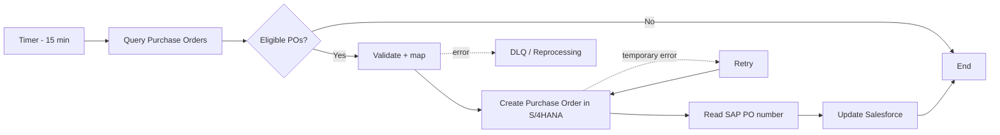

# Purchase Order Integration

### Salesforce → SAP Integration Suite → SAP S/4HANA

> **Architecture case study based on an SAP Discovery Center mission.**
> The source mission demonstrates an Orders integration flow. For this portfolio project, the business object is intentionally modelled as a **Purchase Order**.

This is not presented as a claim that the SAP Mission was executed end-to-end. The mission was used as the starting scenario; the production-oriented architecture decisions below are portfolio design assumptions.

## Scenario

A scheduled integration reads Purchase Orders from Salesforce, validates and transforms them, creates the corresponding Purchase Order in SAP S/4HANA, then writes the SAP Purchase Order number back to Salesforce.

```text
Salesforce
    │
    │ Query eligible Purchase Orders
    ▼
SAP Integration Suite
    │
    │ Validate + transform
    ▼
SAP S/4HANA
    │
    │ Create Purchase Order
    ▼
SAP Integration Suite
    │
    │ Map SAP PO number
    ▼
Salesforce
```

## Architecture at a glance

| Area | Design |
|---|---|
| Source | Salesforce |
| Target | SAP S/4HANA |
| Middleware | SAP Integration Suite / Cloud Integration |
| Pattern | Scheduled polling + request/reply |
| Business object | Purchase Order |
| Frequency | Every 15 minutes |
| Expected volume | ~500 POs/day, peak ~100/hour |
| Processing SLA | 95% within 10 minutes of a scheduled run |
| Error handling | Retry → controlled failure → DLQ/reprocessing |
| Idempotency | Salesforce source PO ID + processing key |

The volume, SLA, schedule and operational limits are **portfolio assumptions**, not values taken from the supplied mission.

## Main flow



## Key design decisions

1. **Cloud Integration is the mediation layer.** It isolates Salesforce and SAP data models and keeps connectivity in one place.
2. **Polling is retained.** A 15-minute schedule is sufficient for the assumed business requirement; an event-driven model can be considered later.
3. **Idempotency is mandatory.** A retry after successful SAP creation must not create a second PO.
4. **Transient and business errors are separated.** Connectivity/timeouts are retried; validation/business errors go to controlled reprocessing.
5. **Production configuration is externalized.** Endpoints, credentials and schedule values are not hard-coded in the flow.

## Repository

- [Architecture](docs/architecture.md)
- [Business requirements](docs/business-requirements.md)
- [API design](docs/api-design.md)
- [Mapping](docs/mapping.md)
- [Error handling](docs/error-handling.md)
- [Security](docs/security.md)
- [Monitoring](docs/monitoring.md)
- [Deployment](docs/deployment-strategy.md)
- [Test strategy](docs/test-strategy.md)
- [ADR](docs/adr-001-integration-mediation.md)
- [Mission evidence](docs/mission-evidence.md)

## Scope boundary

It does not contain a real Purchase Order API contract, Salesforce data model, production volumes or business SLA. Those gaps are filled here only as explicitly labelled portfolio assumptions.
